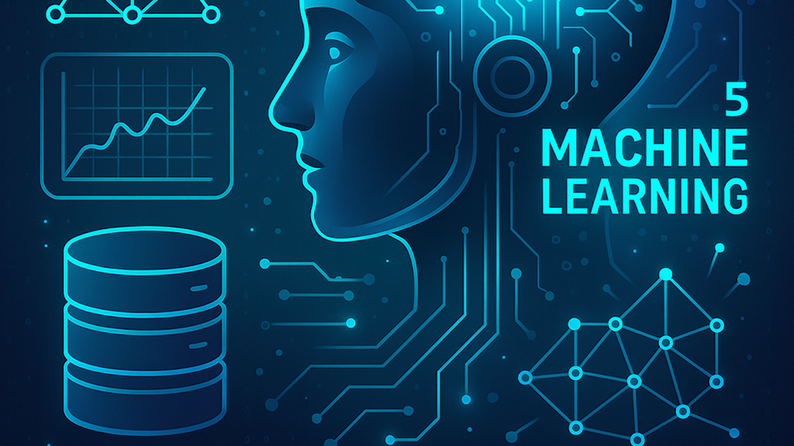

# Azure Machine Learning Step 5: Deploying & Operating Models
Learn how to use one of the most powerful tools for working with Azure

## Details
In this fifth session of the Azure Machine Learning series, we’ll take the next critical step in the ML lifecycle: moving trained models into production and keeping them running reliably. Azure Machine Learning provides robust tools for deploying models as scalable endpoints, managing versions, and monitoring performance in real-world environments.

This session focuses on the practical side of deployment and operations (MLOps) within Azure ML. You’ll learn how to take a trained and registered model and turn it into a production-ready service, while also understanding how to manage, monitor, and update that service over time. Whether you’re continuing from Step 4 or already familiar with model training, this session will help you bridge the gap between experimentation and real-world impact.

You’ll learn:
- How deployment fits into the machine learning lifecycle
- Options for deploying models in Azure ML (real-time endpoints, batch endpoints)
- How to create and manage online endpoints using the Studio UI, SDK, and CLI
- How to package models with environments, scoring scripts, and dependencies
- Techniques for scaling, versioning, and updating deployments (blue/green strategies)
- How to monitor model performance, logs, and resource usage
- Best practices for reliability, cost optimization, and governance
- How to integrate deployed models into applications and workflows

This session is designed to help you move from “I have a trained model” to “I can deploy and operate it in production with confidence.” If you’re ready to deliver real value from your machine learning solutions and ensure they perform reliably at scale, this is your next step.

## Tags
Artificial Intelligence 
Machine Learning 
Cloud Computing 
Microsoft Azure 
